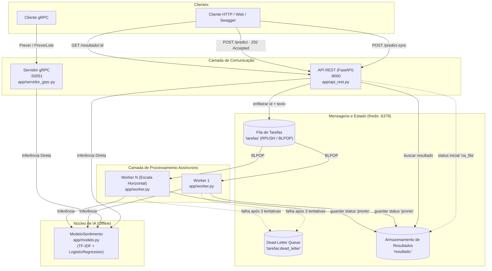

# Guia de Orientação para Agentes de IA: Serviço de Inferência Distribuído (C1.A2)

Este documento foi elaborado para guiar agentes de IA autônomos ou assistentes de código no desenvolvimento, refatoração, teste e documentação deste repositório. Ele sintetiza as diretrizes do **EDITAL.md**, a fundamentação teórica de **EBOOK.md**, o checklist de **TAREFAS.md** e o código-fonte existente.

---

## 1. Visão Geral e Contexto Acadêmico

- **Instituição:** FAESA Centro Universitário (2026/2)
- **Disciplina:** Sistemas Distribuídos e Computação em Nuvem
- **Professor:** Prof. M.Sc. Howard Cruz Roatti
- **Entrega:** Trabalho C1.A2 (Valor: 5,0 pontos) — Avaliação baseada no repositório GitHub (sem apresentação oral).

### Princípio Fundamental (Atenção Máxima)
> **A IA é apenas a carga de trabalho; o que pontua é a Engenharia Distribuída.**
> O modelo de Machine Learning (`app/modelo.py`) já vem treinado/configurado offline via scikit-learn. **NÃO** altere a lógica de predição do modelo, não tente treinar novas redes neurais nem baixar modelos externos da internet. O sistema deve funcionar 100% offline em laboratório.

A avaliação foca em:
1. **Arquitetura e decomposição em serviços (1,5 pts):** Separação límpida entre API, Fila (Message Broker) e Worker.
2. **Comunicação funcionando (1,5 pts):** Interfaces REST e gRPC ativas, integradas e com paridade estrita de resultados.
3. **Resiliência e tratamento de falhas (1,0 pt):** Retentativas, fila de descarte (*dead-letter queue*), logs detalhados e tratamento explícito de exceções.
4. **Execução reproduzível (1,0 pt):** Setup transparente do zero (Docker Compose, venv, scripts de geração de stubs e README claro).

---

## 2. Arquitetura do Sistema

O sistema resolve o problema de **desacoplamento temporal** e **evitação de bloqueio do cliente** para tarefas computacionalmente custosas (inferência de IA).



---

## 3. Estrutura de Arquivos e Estado Atual

```
sd-2026-2-kit-c1a2/
├── app/
│   ├── __init__.py
│   ├── modelo.py           # [PRONTO] Pipeline scikit-learn offline; salva em modelo.joblib.
│   ├── fila.py             # [BASE PRONTA] Métodos Redis: enfileirar, proxima_tarefa, guardar_resultado, buscar_resultado.
│   ├── api_rest.py         # [A IMPLEMENTAR: Tarefas 1 e 2] Rotas POST /predict e GET /resultado/{id}.
│   ├── worker.py           # [A IMPLEMENTAR: Tarefas 3 e 5] Consumo da fila, gravação de resultado, retry + dead-letter.
│   └── servidor_grpc.py    # [A IMPLEMENTAR: Tarefa 4] Implementar RPC PreverLote.
├── proto/
│   └── inferencia.proto    # [CONTRATO gRPC] Define PedidoPrever, RespostaPrever, PedidoLote, RespostaLote.
├── scripts/
│   ├── gerar_stubs.sh      # Script Bash para compilar o .proto com protoc.
│   └── gerar_stubs.ps1     # Script PowerShell para Windows.
├── exemplos/
│   └── cliente_rest.py     # Script de exemplo para testar as rotas síncrona e assíncrona.
├── docker-compose.yml      # Sobe container Redis 7 na porta 6379 com healthcheck.
├── requirements.txt        # Dependências pinadas (FastAPI, Redis, gRPC, scikit-learn, etc.).
├── EDITAL.md               # Edital formal do trabalho com critérios de pontuação.
├── EBOOK.md                # Livro-texto da disciplina contendo a teoria e questões ENADE.
├── TAREFAS.md              # Checklist original de entregas.
├── AGENTS.md               # [ESTE GUIA] Manual para agentes de IA operarem no repositório.
└── README.md               # [A ATUALIZAR: Tarefa 7] Documentação de execução do projeto.
```

---

## 4. Detalhamento das Tarefas e Instruções de Implementação

Ao implementar ou alterar o código, siga rigorosamente as especificações abaixo:

### Tarefa 1: Submissão Assíncrona (`app/api_rest.py`)
- **Objetivo:** Rota `POST /predict`.
- **Comportamento:**
  - Recebe JSON: `{"texto": "conteudo a ser classificado"}`.
  - Valida se `texto` não é vazio ou formado apenas por espaços em branco (retornar `400 Bad Request` se inválido).
  - Invoca `tarefa_id = fila.enfileirar(entrada.texto)`.
  - Retorna **imediatamente** com status HTTP `202 Accepted`.
  - Corpo da resposta: `{"id": tarefa_id, "status": "na_fila"}`.
  - **Invariante:** NUNCA chamar `modelo.prever()` dentro desta rota. A rota deve ser ultra rápida e não bloqueante.

### Tarefa 2: Consulta de Resultado (`app/api_rest.py`)
- **Objetivo:** Rota `GET /resultado/{tarefa_id}`.
- **Comportamento:**
  - Busca o resultado com `fila.buscar_resultado(tarefa_id)`.
  - Se `None`, lança `HTTPException(status_code=404, detail="Tarefa não encontrada")`.
  - Se existir, retorna o dicionário contendo o estado (ex.: `status: "na_fila"`, ou `status: "pronto"` com os dados `sentimento`, `confianca`, `tempo_ms`, ou `status: "erro"`).

### Tarefa 3: Worker Grava o Resultado (`app/worker.py`)
- **Objetivo:** Processar tarefas retiradas do Redis e persistir a resposta.
- **Comportamento:**
  - No bloco `try` de `main()` no worker:
    - Executa `resultado = modelo.prever(tarefa["texto"])`.
    - Adiciona metadados: `resultado["status"] = "pronto"`, `resultado["tempo_ms"] = ...`.
    - Executa `fila.guardar_resultado(tarefa["id"], resultado)`.
    - Remove o placeholder `raise NotImplementedError("guarde o resultado na TAREFA 3")`.

### Tarefa 4: Método gRPC `PreverLote` (`app/servidor_grpc.py` e `proto/inferencia.proto`)
- **Objetivo:** Processamento em lote via gRPC sob HTTP/2 com Protocol Buffers.
- **Comportamento:**
  - No arquivo `proto/inferencia.proto`, o contrato já declara:
    ```protobuf
    rpc PreverLote (PedidoLote) returns (RespostaLote);
    ```
  - Em `app/servidor_grpc.py`, implementar dentro da classe `ServicoInferencia`:
    ```python
    def PreverLote(self, request, context):
        respostas = []
        for t in request.textos:
            r = self.modelo.prever(t)
            respostas.append(
                inferencia_pb2.RespostaPrever(
                    texto=r["texto"],
                    sentimento=r["sentimento"],
                    confianca=r["confianca"],
                )
            )
        return inferencia_pb2.RespostaLote(resultados=respostas)
    ```
  - **Regra de ouro:** A predição deve utilizar a mesma instância de `self.modelo` carregada no `__init__`, garantindo que os resultados para o mesmo texto sejam estritamente idênticos aos do endpoint REST.

### Tarefa 5: Resiliência, Retentativas e Dead-Letter Queue (`app/worker.py` e `app/fila.py`)
- **Objetivo:** Tolerância a falhas parciais e isolamento de mensagens venenosas (*poison pills*).
- **Especificação:**
  - Estrutura da mensagem na fila: incluir contador de tentativas `tentativas` (iniciando em 0 ou 1).
  - Em `app/fila.py`, criar funções auxiliares se necessário (ex.: `enfileirar_dead_letter(tarefa, erro)`).
  - No `worker.py`, ao capturar uma exceção durante o processamento de uma tarefa:
    - Incrementar `tarefa["tentativas"] = tarefa.get("tentativas", 1) + 1`.
    - Se `tarefa["tentativas"] <= 3`:
      - Reenfileirar na fila principal (`fila_tarefas`) para reprocessamento (com log de aviso informando a retentativa atual).
      - Opcional/Recomendado: Atualizar o status em `resultado:<id>` para `{"status": "retentando", "tentativas": ...}`.
    - Se ultrapassar 3 tentativas:
      - Despachar para a fila de descarte: `cliente().rpush("tarefas:dead_letter", json.dumps({"tarefa": tarefa, "erro": str(erro), "timestamp": time.time()}))`.
      - Atualizar o resultado final para o cliente: `fila.guardar_resultado(tarefa["id"], {"status": "erro", "detalhes": str(erro)})`.
      - Registrar log de erro crítico (`ERROR` ou `CRITICAL`).

### Tarefa 6: Observabilidade e Log Estruturado
- **Objetivo:** Registro explícito de requisições em todos os serviços.
- **Onde aplicar:**
  1. **REST API (`app/api_rest.py`):** Middleware ou interceptor de requisições registrando:
     - Método HTTP, caminho (`path`), status retornado.
     - Identificador da requisição / tarefa.
     - Tamanho da entrada (`len(texto)`).
     - Tempo de resposta em milissegundos (`tempo_ms`).
  2. **Worker (`app/worker.py`):** Logs detalhados a cada tarefa:
     - ID da tarefa recebida.
     - Tempo de execução da inferência.
     - Tentativas efetuadas e destino (sucesso / reprocessamento / dead-letter).
  3. **gRPC Server (`app/servidor_grpc.py`):** Logs nos métodos `Prever` e `PreverLote` registrando quantidade de itens no lote e tempo gasto.
- **Formato recomendado:** Usar o módulo `logging` padrão do Python com formato legível e consistente contendo timestamps ISO e níveis (`INFO`, `WARNING`, `ERROR`).

### Tarefa 7: README Reproduzível (`README.md`)
- Deve ser reescrito com instruções precisas para qualquer avaliador clonar e rodar o projeto do zero sem erros:
  1. Pré-requisitos (Python 3.10+, Docker, Docker Compose).
  2. Criação e ativação da `.venv`.
  3. Instalação com `pip install -r requirements.txt`.
  4. Execução do Redis via `docker compose up -d`.
  5. Geração dos stubs gRPC via script ou comando direto.
  6. Como iniciar a API REST, o Worker e o Servidor gRPC.
  7. Exemplos de chamadas práticas (curl, script Python, Swagger docs).
  8. Diagrama e explicação clara da arquitetura e das decisões de projeto tomadas.

---

## 5. Extensões Opcionais (Diferenciais Técnicos)

Embora o edital mencione que não contam nota extra direta, elas agregam robustez e consolidam nota máxima nos critérios de arquitetura e resiliência:

1. **Subir múltiplos Workers:**
   - Garantir concorrência limpa via `BLPOP` do Redis (atomicidade intrínseca do Redis evita condições de corrida na entrega de tarefas).
   - Demonstrar divisão de carga com 2 instâncias do worker rodando paralelamente.
2. **Cache de Resultados:**
   - Para textos idênticos, salvar em chave de cache (ex.: `cache:<hash_sha256(texto)>`).
   - Se já existir, devolver a predição imediatamente sem reprocessar no modelo.
3. **Métricas de Latência:**
   - Endpoint `/metricas` no FastAPI expondo contagem total de requisições, tempo médio de inferência e número de mensagens na fila / dead-letter.
4. **Processamento em Lote no REST:**
   - Endpoint `POST /predict-lote` recebendo lista de textos e gerando lista de IDs ou processando em lote.

---

## 6. Conceitos Teóricos do Ebook Relevantes para a Implementação

Ao documentar no README ou tomar decisões de código, use a terminologia correta ensinada na disciplina:

- **Desacoplamento Espacial e Temporal:** O cliente REST e o Worker não se conhecem e não precisam estar disponíveis no mesmo instante temporal. O Redis atua como intermediário assíncrono (*Message-Oriented Middleware - MOM*).
- **Semântica de Entrega e Dead-Letter:** Evita que falhas transitórias travem o consumidor e impede que *poison messages* fiquem em loop infinito.
- **Contrato Tipado com Protocol Buffers vs OpenAPI:**
  - gRPC usa contrato rígido pré-compilado (`.proto`) com serialização binária compacta sobre HTTP/2 multiplexado.
  - REST usa HTTP/JSON e gera documentação viva OpenAPI via reflexão de tipos do Pydantic.
- **Idempotência:** Consultas `GET /resultado/{id}` são idempotentes e seguras (não alteram estado). A submissão `POST /predict` é não-idempotente (cria um novo recurso com novo UUID a cada chamada).
- **Cold Start vs Carregamento Único:** O modelo ML deve ser carregado **uma única vez** no início do ciclo de vida dos processos (`startup` do FastAPI, inicialização do `worker`, `__init__` do Servicer gRPC). Jamais carregar o modelo dentro de funções de rota ou loops de eventos.

---

## 7. Regras Estritas e Boas Práticas de Código

1. **Imports dos Stubs gRPC:**
   Ao gerar os stubs na raiz do projeto (`--python_out=.`), o arquivo gerado `inferencia_pb2_grpc.py` faz `import inferencia_pb2`. Certifique-se de que os stubs são gerados corretamente e executáveis tanto via `python -m app.servidor_grpc` quanto em testes.
2. **Tratamento de Strings e Tipos:**
   Sempre sanitize e valide as entradas (ex.: rejeitar textos vazios com `HTTPException(400)`).
3. **Não alterar `CAMINHO` nem `TREINO` em `app/modelo.py`:**
   Mantenha a integridade do arquivo gerado `modelo.joblib`.
4. **Preservar compatibilidade de schemas:**
   Os retornos do modelo possuem as chaves `texto`, `sentimento` e `confianca`. Todas as interfaces devem espelhar fielmente essas propriedades.

---

## 8. Roteiro de Validação e Testes Passo a Passo

Antes de considerar o trabalho finalizado, o agente ou desenvolvedor deve verificar cada um dos seguintes passos:

### Passo 1: Dependências e Infraestrutura
```bash
docker compose up -d
docker compose ps
# Verificar que redis está Healthy na porta 6379
```

### Passo 2: Geração de Stubs gRPC
```bash
python -m grpc_tools.protoc -I proto --python_out=. --grpc_python_out=. proto/inferencia.proto
# Verificar existência de inferencia_pb2.py e inferencia_pb2_grpc.py
```

### Passo 3: Teste da API REST
1. Iniciar API: `uvicorn app.api_rest:app --port 8000`
2. Testar health check:
   ```bash
   curl -s http://localhost:8000/saude
   ```
3. Testar rota síncrona:
   ```bash
   curl -s -X POST http://localhost:8000/predict-sync -H "Content-Type: application/json" -d '{"texto": "o produto e incrivel"}'
   ```
4. Testar submissão assíncrona (esperar HTTP 202 e retorno de `id`):
   ```bash
   curl -s -i -X POST http://localhost:8000/predict -H "Content-Type: application/json" -d '{"texto": "entrega super rapida"}'
   ```
5. Testar consulta antes do worker (deve retornar `na_fila`):
   ```bash
   curl -s http://localhost:8000/resultado/<ID_OBTIDO>
   ```

### Passo 4: Teste do Worker
1. Iniciar worker em outro terminal: `python -m app.worker`
2. Consultar novamente o resultado (deve retornar `status: "pronto"`, sentimento e confiança):
   ```bash
   curl -s http://localhost:8000/resultado/<ID_OBTIDO>
   ```
3. Testar id inexistente (deve retornar 404 Not Found):
   ```bash
   curl -s -i http://localhost:8000/resultado/id-inexistente-123
   ```

### Passo 5: Teste do Servidor gRPC e Paridade
1. Iniciar servidor gRPC: `python -m app.servidor_grpc`
2. Criar ou executar cliente de teste gRPC chamando `Prever` e `PreverLote`.
3. Validar se a predição para `"o produto e incrivel"` devolve exatamente o mesmo sentimento e confiança no gRPC e no REST.

### Passo 6: Teste de Resiliência (Dead-Letter)
1. Inserir na fila uma tarefa propositalmente corrompida (ou simular erro no processamento).
2. Constatar que o worker tenta processar 3 vezes e despacha a tarefa para `tarefas:dead_letter`.
3. Validar no Redis CLI:
   ```bash
   docker exec -it sd-2026-2-kit-c1a2-redis-1 redis-cli LLEN tarefas:dead_letter
   ```

### Passo 7: Teste do Zero (Simulação de Clonagem Limpa)
1. Remover arquivos temporários (`.joblib`, stubs compilados `inferencia_pb2*`).
2. Seguir passo a passo as instruções do novo `README.md` para garantir que o ambiente sobe sem nenhum comando implícito ou dependência oculta.
