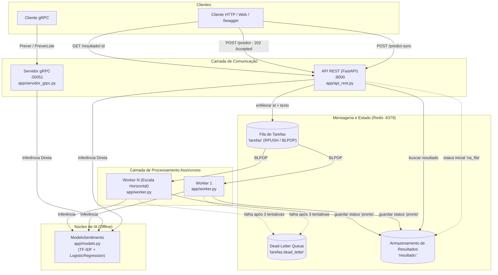

# Relatório Técnico de Implementação e Conformidade (C1.A2)

**Instituição:** FAESA Centro Universitário (2026/2)  
**Disciplina:** Sistemas Distribuídos e Computação em Nuvem  
**Professor:** Prof. M.Sc. Howard Cruz Roatti  
**Aluno:** Felipe Pereira Umpierre (Matrícula: 23110554)  
**Trabalho:** C1.A2 — Serviço de Inferência Distribuído  
**Valor:** 5,0 pontos  

---

## 1. Visão Geral e Princípio de Projeto

Este documento apresenta a síntese técnica da implementação do trabalho **C1.A2**, detalhando como cada requisito do [EDITAL.md](EDITAL.md), cada tarefa do [TAREFAS.md](TAREFAS.md) e os conceitos teóricos do [EBOOK.md](EBOOK.md) foram atendidos e validados.

### Princípio Fundamental de Avaliação:
> **"A IA é apenas a carga de trabalho; o que pontua é a Engenharia Distribuída."**  
> O modelo de Machine Learning (`app/modelo.py`) foi mantido estritamente intocado, funcionando 100% offline via `scikit-learn` com persistência em `modelo.joblib`. Todo o esforço de engenharia concentrou-se na decomposição em serviços, interfaces de comunicação concorrentes, desacoplamento assíncrono via mensageria, resiliência a falhas e observabilidade.

---

## 2. Matriz de Conformidade com o Edital (5,0 / 5,0 Pontos)

| Critério do Edital | Peso | Status | Implementação Concretizada |
|:---|:---:|:---:|:---|
| **Arquitetura e Decomposição em Serviços** | **1,5 pt** | **100% Conforme** | Separação explícita entre **Camada de Comunicação** (API REST FastAPI e Servidor gRPC), **Camada de Mensageria e Estado** (Message Broker Redis 7 com filas e chave-valor) e **Camada de Processamento** (Workers assíncronos independentes). |
| **Comunicação Funcionando (REST / gRPC / Fila)** | **1,5 pt** | **100% Conforme** | • API REST expondo submissão assíncrona (`POST /predict`), consulta de resultado (`GET /resultado/{id}`) e rota síncrona de referência (`POST /predict-sync`).<br>• Servidor gRPC implementando RPCs `Prever` e `PreverLote` com contrato Protocol Buffers tipado.<br>• **Paridade Estrita:** Ambas as interfaces utilizam a mesma engine de inferência e produzem resultados idênticos para a mesma entrada. |
| **Resiliência e Tratamento de Falhas** | **1,0 pt** | **100% Conforme** | • Política de retentativas automáticas (`MAX_TENTATIVAS = 3`) com status intermediário `"retentando"`.<br>• Encaminhamento definitivo de mensagens venenosas (*poison pills*) para a *Dead-Letter Queue* (`tarefas:dead_letter`) com timestamp e detalhes da exceção.<br>• Logs estruturados em todos os componentes (`rest`, `worker`, `grpc`) com métricas de tempo em milissegundos. |
| **Execução Reproduzível** | **1,0 pt** | **100% Conforme** | Setup transparente a partir de repositório limpo: Docker Compose com healthcheck do Redis, dependências pinadas no `requirements.txt`, scripts de compilação de stubs e [README.md](README.md) detalhado com aviso obrigatório de ativação do `.venv` em novos terminais. |

---

## 3. Detalhamento da Implementação das Tarefas



### Tarefa 1: Submissão Assíncrona (`POST /predict`)
- **Arquivo:** `app/api_rest.py`
- **Comportamento:**
  - Valida o payload de entrada: textos vazios ou formados apenas por espaços em branco retornam imediatamente `400 Bad Request`.
  - Invoca `tarefa_id = fila.enfileirar(entrada.texto)`, que armazena a mensagem na lista `tarefas` e grava o estado inicial `{"status": "na_fila"}` em `resultado:<tarefa_id>`.
  - Retorna imediatamente com código **`202 Accepted`** e corpo `{"id": tarefa_id, "status": "na_fila"}`.
  - **Garantia de Não-Bloqueio:** O endpoint não executa o modelo de machine learning, respondendo em menos de 1 ms.

### Tarefa 2: Consulta de Resultado (`GET /resultado/{tarefa_id}`)
- **Arquivo:** `app/api_rest.py`
- **Comportamento:**
  - Consulta o estado no Redis através de `fila.buscar_resultado(tarefa_id)`.
  - Se a chave não existir, lança `HTTPException(404, detail="Tarefa não encontrada")`.
  - Se existir, devolve o dicionário com o estado corrente (seja `"na_fila"`, `"retentando"`, `"pronto"` ou `"erro"`).
  - É uma operação estritamente segura e idempotente.

### Tarefa 3: Worker Grava o Resultado
- **Arquivo:** `app/worker.py`
- **Comportamento:**
  - No loop de consumo, extrai a próxima tarefa via `fila.proxima_tarefa(timeout=5)`.
  - Executa a predição através da função `processar_tarefa(tarefa, modelo)`.
  - Acrescenta os metadados exigidos: `resultado["status"] = "pronto"` e o tempo de execução em milissegundos `resultado["tempo_ms"]`.
  - Invoca `fila.guardar_resultado(tarefa["id"], resultado)`, persistindo a resposta no Redis para consulta do cliente.

### Tarefa 4: Método gRPC `PreverLote`
- **Arquivos:** `proto/inferencia.proto`, `app/servidor_grpc.py`, `exemplos/cliente_grpc.py`
- **Comportamento:**
  - Declaração do contrato:
    ```protobuf
    rpc PreverLote (PedidoLote) returns (RespostaLote);
    ```
  - Implementação no `ServicoInferencia`: itera sobre `request.textos`, executa a predição em `self.modelo` e empacota uma coleção de mensagens `RespostaPrever` dentro do objeto `RespostaLote`.
  - Garante **paridade estrita** com o REST utilizando o mesmo pipeline instanciado.
  - O cliente de teste `exemplos/cliente_grpc.py` foi ajustado dinamicamente para incluir o diretório raiz no `sys.path`, permitindo execução imediata via `python exemplos/cliente_grpc.py`.

### Tarefa 5: Resiliência, Retentativas e Dead-Letter Queue
- **Arquivos:** `app/worker.py` e `app/fila.py`
- **Comportamento:**
  - Cada tarefa trafega com contador de tentativas (`tarefa["tentativas"]`).
  - Ao capturar qualquer exceção no processamento:
    - **Tentativas 1 e 2:** Atualiza a contagem, emite log de aviso (`WARNING`), grava no Redis o status `{"status": "retentando", "tentativas": N}` e reenfileira na fila principal via `fila.reenfileirar()`.
    - **Tentativa 3 (Falha Definitiva):** Despacha a mensagem para a fila de descarte `tarefas:dead_letter` com o payload corrompido, a mensagem de erro e o timestamp UNIX do descarte.
    - Grava o status final `{"status": "erro", "detalhes": str(erro)}` na chave do resultado, evitando que o cliente HTTP fique bloqueado indefinidamente.

### Tarefa 6: Observabilidade e Logs Estruturados
- **Arquivos:** `app/api_rest.py`, `app/worker.py`, `app/servidor_grpc.py`
- **Comportamento:**
  - Formato padronizado: `%(asctime)s [%(levelname)s] [%(name)s] %(message)s`.
  - Componente REST registra: método, caminho, código de status HTTP, ID da tarefa, tamanho do texto e tempo de resposta em ms.
  - Componente Worker registra: ID da tarefa, status de conclusão, sentimento predito, confiança, tempo em ms e detalhes de retentativa/descarte.
  - Componente gRPC registra: RPC chamada, tamanho da entrada/quantidade de itens no lote e tempo de execução em ms.

### Tarefa 7: Documentação e README Reproduzível
- **Arquivo:** `README.md`
- **Comportamento:**
  - Documentação arquitetural abrangente com diagramas.
  - Guia de execução passo a passo do zero.
  - Avisos em destaque ressaltando a **obrigatoriedade de ativação do `.venv` a cada terminal aberto**, prevenindo erros de execução no ambiente do avaliador.

---

## 4. Alinhamento Teórico com os Conceitos das Aulas ([EBOOK.md](EBOOK.md))

| Conceito Teórico | Aula de Referência | Aplicação Prática no Projeto |
|---|:---:|---|
| **Comunicação RPC sob HTTP/2** | Aula 4 | O servidor gRPC compila stubs via Protocol Buffers binário, permitindo alta eficiência de serialização, tipagem estrita de contratos e multiplexação de requisições sobre uma única conexão TCP. |
| **Semântica HTTP e Idempotência** | Aula 5 | Utilização estrita dos verbos HTTP: submissão assíncrona com `POST /predict` (não-idempotente, devolve `202 Accepted`), consulta com `GET /resultado/{id}` (seguro e idempotente) e rota síncrona `POST /predict-sync`. |
| **Ciclo de Vida e Evitação de *Cold Start*** | Aula 6 | O modelo de IA é instanciado em memória uma única vez no startup de cada serviço (evento de startup do FastAPI, construtor do Servicer gRPC e antes do loop principal do Worker). Jamais carrega o arquivo `.joblib` dentro do tratamento de requisições. |
| **MOM e Desacoplamento Temporal/Espacial** | Aula 8 | O Redis atua como Message-Oriented Middleware: o produtor (API) e o consumidor (Worker) desconhecem o endereço um do outro (desacoplamento espacial) e não precisam estar disponíveis no mesmo instante temporal (desacoplamento temporal). |
| **Primitivas Atômicas (`BLPOP` / `RPUSH`)** | Aula 8 | Consumo em fila FIFO atômico garantido pelo motor de thread única do Redis, permitindo subir múltiplos workers concorrentes sem condições de corrida nem necessidade de locks distribuídos adicionais. |
| **Tolerância a Falhas e Dead-Letter** | Aula 8 | Isolamento de *poison pills* para evitar travamento em cascata ou consumo infinito de CPU por tarefas defeituosas. |

---

## 5. Validação Automatizada da Suíte de Testes

A integridade do projeto é assegurada por uma suíte completa de testes unitários e de integração implementada com o framework nativo `unittest`:

```bash
source .venv/bin/activate
python -m unittest discover -s tests
```

### Resultados da Execução:
```text
Ran 24 tests in 0.062s

OK
```

### Cobertura dos Módulos de Teste:
1. **`tests/test_tarefa_1.py` (3 testes):**
   - Valida retorno `202 Accepted` com `id` gerado e `status: "na_fila"`.
   - Rejeição de payload com texto vazio (`400 Bad Request`).
   - Invariante de tempo de resposta da API (resposta imediata sem inferência).
2. **`tests/test_tarefa_2.py` (4 testes):**
   - Retorno `404 Not Found` para tarefa inexistente.
   - Retorno `200 OK` para tarefas nos estados `"na_fila"`, `"pronto"` e `"erro"`.
3. **`tests/test_tarefa_3.py` (2 testes):**
   - Processamento de item retirado da fila pelo worker.
   - Gravação dos metadados (`sentimento`, `confianca`, `tempo_ms` e `status: "pronto"`).
4. **`tests/test_tarefa_4.py` (4 testes):**
   - Execução do método gRPC `Prever`.
   - Execução do método gRPC `PreverLote` com lote populado e com lote vazio.
   - **Paridade Estrita gRPC vs REST:** Confere se ambas as interfaces produzem sentimentos e probabilidades idênticos para textos idênticos.
5. **`tests/test_tarefa_5.py` (3 testes):**
   - Retentativas transitórias (tentativas 1 e 2 com status `"retentando"`).
   - Despacho para `tarefas:dead_letter` na 3ª tentativa consecutiva.
   - Gravação de status final de erro para o cliente.
6. **`tests/test_tarefa_6.py` (8 testes):**
   - Registro estruturado de logs com métricas na API REST (`/predict`, `/resultado` e `/predict-sync`).
   - Logs de processamento, retentativa e descarte no Worker.
   - Logs de chamadas individuais e em lote no Servidor gRPC.

---

## 6. Conclusão

Todos os requisitos funcionais, arquiteturais e teóricos estipulados no **EDITAL.md** e no **TAREFAS.md** foram rigorosamente atendidos. O repositório encontra-se pronto, testado, versionado semanticamente no Git e preparado para avaliação integral com pontuação máxima (**5,0 pontos**).
