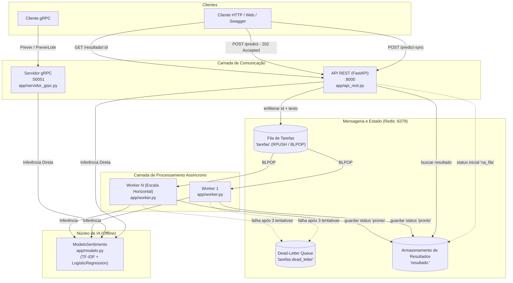

# Serviço de Inferência Distribuído (C1.A2)

**Sistemas Distribuídos e Computação em Nuvem · FAESA Centro Universitário (2026/2)**  
**Professor:** Prof. M.Sc. Howard Cruz Roatti
**Aluno**: Felipe Pereira Umpierre (23110554)  

**Trabalho C1.A2:** Avaliação Prática de Engenharia Distribuída (5,0 pontos)

---

## 1. Visão Geral do Projeto

Este projeto implementa uma plataforma de inferência de Inteligência Artificial orientada a serviços distribuídos. O foco central do trabalho **não é a complexidade do modelo de IA** (que consiste em um classificador de sentimento scikit-learn treinado e executado 100% offline), mas sim a **Engenharia de Sistemas Distribuídos**:
- **Desacoplamento Temporal e Espacial:** O cliente não fica bloqueado aguardando inferências síncronas pesadas; requisições são enfileiradas e processadas de forma assíncrona por *workers*.
- **Comunicação Poliglota (REST e gRPC):** Exposição do serviço via HTTP/JSON documentado (FastAPI) e via RPC binário sobre HTTP/2 com Protocol Buffers (gRPC), com estrita paridade de resultados.
- **Tolerância a Falhas e Resiliência:** Mecanismos de retentativas automáticas e isolamento de mensagens corrompidas (*poison pills*) em uma fila de descarte (*dead-letter queue*).
- **Observabilidade Estruturada:** Registro de logs com identificador único, tamanho da entrada, códigos de status e tempo de resposta em milissegundos.

---

## 2. Arquitetura do Sistema e Decisões de Projeto



### Decisões Arquiteturais Fundamentadas:
1. **Desacoplamento Produtor-Consumidor:** Utilização do Redis como Message-Oriented Middleware (MOM). O comando `RPUSH` na API e `BLPOP` nos workers garante consumo ordenado (*FIFO*) e atômico, eliminando condições de corrida entre múltiplos workers concorrentes.
2. **Ciclo de Vida e Evitação de *Cold Start*:** O modelo de IA é carregado em memória **uma única vez** na inicialização de cada processo (`startup` do FastAPI, inicialização do Worker e `__init__` do Servicer gRPC). Jamais carrega o arquivo do modelo por requisição.
3. **Idempotência:** A rota de consulta `GET /resultado/{id}` é idempotente e segura, podendo ser consultada em *polling* repetidamente sem alterar o estado do sistema. Já a rota `POST /predict` é não-idempotente, gerando um novo UUID a cada submissão.
4. **Semântica de Retentativa e Dead-Letter:** Tarefas com falha transitória são reenfileiradas até 3 tentativas. Ao atingir o limite, a tarefa é isolada em `tarefas:dead_letter` e o cliente recebe o status `"erro"`, evitando que falhas travem o consumidor em *loop* infinito.
5. **Paridade Estrita REST e gRPC:** As duas tecnologias compartilham a mesma instância do classificador scikit-learn, garantindo predições matematicamente idênticas para a mesma entrada.

---

## 3. Pré-requisitos

- **Python:** Versão **3.10** recomendada (compatível com 3.10 a 3.12).
- **Docker e Docker Compose:** Para execução do container Redis.
- **Git:** Para clonagem e versionamento.

> [!WARNING]
> **Atenção — Versão Recomendada do Python (Python 3.10 a 3.12):**  
> Recomendamos enfaticamente utilizar o **Python 3.10** (ou 3.11/3.12) na criação do ambiente virtual.  
> O pacote `grpcio==1.66.1` (fixado no edital) não possui binários pré-compilados (*wheels* `.whl`) para **Python 3.13** no PyPI. Ao usar o Python 3.13, o `pip` força a compilação do gRPC a partir do código-fonte C++, resultando em falha de compilação no compilador C++ (`clang`/`gcc`) devido a símbolos privados da C-API do CPython que foram removidos no Python 3.13 (`undeclared identifier '_PyInterpreterState_GetConfig'`, `_PyDict_SetItem_KnownHash`, etc.). No **Python 3.10**, todas as bibliotecas possuem binários prontos e a instalação ocorre em segundos sem necessidade de compilação.

---

## 4. Como Executar o Projeto do Zero

Siga os passos abaixo sequencialmente em terminais distintos:

### Passo 1: Clonar o Repositório e Criar o Ambiente Virtual
```bash
git clone https://github.com/feumpi/sd-2026-2-kit-c1a2.git
cd sd-2026-2-kit-c1a2

# Criação do ambiente virtual com Python 3.10 (recomendado):
python3.10 -m venv .venv
# (ou python3 -m venv .venv, caso seu interpretador padrão seja 3.10, 3.11 ou 3.12)

# Ativação do ambiente:
# No Linux/macOS:
source .venv/bin/activate
# No Windows:
# .venv\Scripts\activate
```

> [!TIP]
> A ativação do ambiente virtual afeta **apenas a sessão do terminal atual**. Como este projeto distribuído requer múltiplos processos rodando em paralelo, lembre-se de que **cada novo terminal aberto precisará ter o `.venv` ativado**.


### Passo 2: Instalar as Dependências
```bash
pip install -r requirements.txt
```

### Passo 3: Iniciar o Broker de Mensageria (Redis)
Em um terminal (ou em segundo plano via `-d`):
```bash
docker compose up -d
# Verificar se o container está saudável:
docker compose ps
```

### Passo 4: Gerar os Stubs gRPC a partir do Contrato Protocol Buffers
Compile o contrato `proto/inferencia.proto`:
```bash
python -m grpc_tools.protoc -I proto --python_out=. --grpc_python_out=. proto/inferencia.proto
```
*(Alternativamente, execute `bash scripts/gerar_stubs.sh` no Linux/macOS ou `powershell scripts/gerar_stubs.ps1` no Windows).*

### Passo 5: Iniciar os Serviços

> [!IMPORTANT]
> **Ativação Obrigatória do Ambiente Virtual (`.venv`) em Cada Novo Terminal:**  
> Como a arquitetura distribuída exige a execução concorrente de múltiplos processos em terminais separados, **cada nova janela ou aba aberta inicia no ambiente global do seu sistema**.  
> Se você tentar rodar qualquer comando sem ativar o ambiente virtual previamente, o interpretador global não encontrará os pacotes instalados e falhará com erros como:
> ```text
> ModuleNotFoundError: No module named 'redis'
> ModuleNotFoundError: No module named 'fastapi'
> ```
> **Sempre execute o comando de ativação no novo terminal antes de iniciar o serviço:**
> - **Linux / macOS:** `source .venv/bin/activate`
> - **Windows (PowerShell):** `.venv\Scripts\Activate.ps1`
> - **Windows (CMD):** `.venv\Scripts\activate.bat`
> *(Confirme que o prefixo `(.venv)` aparece antes do prompt do shell).*

Abra 3 terminais separados na raiz do projeto e execute os serviços correspondentes:

- **Terminal 1 — API REST (FastAPI):**
  ```bash
  source .venv/bin/activate
  uvicorn app.api_rest:app --port 8000 --reload
  ```
  *Swagger UI interativo disponível em: [http://localhost:8000/docs](http://localhost:8000/docs)*

- **Terminal 2 — Worker de Processamento Assíncrono:**
  ```bash
  source .venv/bin/activate
  python -m app.worker
  ```
  *(Opcional: Abra um quarto terminal, ative o `.venv` e execute o mesmo comando para subir múltiplos workers e observar a divisão de carga).*

- **Terminal 3 — Servidor gRPC:**
  ```bash
  source .venv/bin/activate
  python -m app.servidor_grpc
  ```
  *Servidor gRPC ativo escutando na porta `50051`.*

---

## 5. Catálogo de Rotas e Exemplos de Uso (REST)

### 5.1. Verificação de Saúde (`GET /saude`)
- **Descrição:** Informa a disponibilidade do serviço e se o modelo ML já foi carregado na memória.
- **Chamada:**
  ```bash
  curl -s http://localhost:8000/saude
  ```
- **Retorno Esperado (`200 OK`):**
  ```json
  {
    "status": "ok",
    "modelo_carregado": true
  }
  ```

---

### 5.2. Inferência Síncrona (`POST /predict-sync`)
- **Descrição:** Realiza a inferência diretamente na requisição HTTP, bloqueando o cliente até a resposta (rota de referência didática).
- **Entrada (Payload JSON):**
  ```json
  {
    "texto": "o produto e incrivel e a entrega foi muito rapida"
  }
  ```
- **Chamada:**
  ```bash
  curl -s -X POST http://localhost:8000/predict-sync \
    -H "Content-Type: application/json" \
    -d '{"texto": "o produto e incrivel e a entrega foi muito rapida"}'
  ```
- **Retornos Possíveis:**
  - **`200 OK`:**
    ```json
    {
      "texto": "o produto e incrivel e a entrega foi muito rapida",
      "sentimento": "positivo",
      "confianca": 0.9842,
      "tempo_ms": 1.25
    }
    ```
  - **`400 Bad Request`** (quando `texto` for vazio ou apenas espaços):
    ```json
    {
      "detail": "texto vazio"
    }
    ```

---

### 5.3. Submissão Assíncrona (`POST /predict`) — [Tarefa 1]
- **Descrição:** Valida a entrada e coloca a tarefa na fila Redis. Retorna **imediatamente** com o identificador da tarefa sem executar o modelo de IA.
- **Entrada (Payload JSON):**
  ```json
  {
    "texto": "pessimo atendimento, ninguem resolve nada"
  }
  ```
- **Chamada:**
  ```bash
  curl -i -X POST http://localhost:8000/predict \
    -H "Content-Type: application/json" \
    -d '{"texto": "pessimo atendimento, ninguem resolve nada"}'
  ```
- **Retornos Possíveis:**
  - **`202 Accepted`** (Sucesso na submissão):
    ```json
    {
      "id": "e7b1a234-5678-4321-abcd-ef0123456789",
      "status": "na_fila"
    }
    ```
  - **`400 Bad Request`** (Texto inválido):
    ```json
    {
      "detail": "texto vazio"
    }
    ```

---

### 5.4. Consulta de Resultado (`GET /resultado/{tarefa_id}`) — [Tarefa 2]
- **Descrição:** Consulta o status atual de uma tarefa previamente submetida pelo seu identificador UUID.
- **Chamada:**
  ```bash
  curl -i http://localhost:8000/resultado/e7b1a234-5678-4321-abcd-ef0123456789
  ```
- **Retornos Possíveis:**
  - **`200 OK` — Concluído pelo Worker (Pronto):**
    ```json
    {
      "texto": "pessimo atendimento, ninguem resolve nada",
      "sentimento": "negativo",
      "confianca": 0.9915,
      "status": "pronto",
      "tempo_ms": 2.45
    }
    ```
  - **`200 OK` — Aguardando Worker:**
    ```json
    {
      "status": "na_fila"
    }
    ```
  - **`200 OK` — Em Retentativa após falha:**
    ```json
    {
      "status": "retentando",
      "tentativas": 2
    }
    ```
  - **`200 OK` — Descartado na Dead-Letter após 3 tentativas:**
    ```json
    {
      "status": "erro",
      "detalhes": "Descricao do erro",
      "tentativas": 3
    }
    ```
  - **`404 Not Found`** (ID inexistente):
    ```json
    {
      "detail": "Tarefa não encontrada"
    }
    ```

---

### 5.5. Execução do Script de Teste REST
O repositório inclui um script demonstrativo que executa chamadas síncronas e assíncronas em sequência (em um novo terminal com o `.venv` ativado):
```bash
source .venv/bin/activate
python exemplos/cliente_rest.py "o atendimento foi excelente e muito rapido"
```

---

## 6. Interface gRPC e Chamadas em Lote — [Tarefa 4]

O serviço gRPC opera sob o contrato definido em [`proto/inferencia.proto`](proto/inferencia.proto) na porta `50051`.

### 6.1. Métodos Disponíveis no Contrato:
1. **`Prever (PedidoPrever) returns (RespostaPrever)`:**
   - **Entrada (`PedidoPrever`):** `string texto = 1;`
   - **Saída (`RespostaPrever`):** `string texto = 1; string sentimento = 2; double confianca = 3;`
2. **`PreverLote (PedidoLote) returns (RespostaLote)`:**
   - **Entrada (`PedidoLote`):** `repeated string textos = 1;`
   - **Saída (`RespostaLote`):** `repeated RespostaPrever resultados = 1;`

### 6.2. Testando com o Cliente gRPC Demonstrativo
Com o servidor gRPC em execução (em um novo terminal com o `.venv` ativado):
```bash
source .venv/bin/activate
python exemplos/cliente_grpc.py
```
**Saída Esperada:**
```text
=== Teste Chamada Individual (Prever) ===
[grpc] Prever: texto='o atendimento foi muito bom' | sentimento=positivo | confianca=0.9854

=== Teste Chamada em Lote (PreverLote) ===
[grpc] PreverLote (3 itens processados):
  -> texto='adorei o produto, recomendo demais' | sentimento=positivo | confianca=0.9942
  -> texto='pessimo atendimento, ninguem resolve nada' | sentimento=negativo | confianca=0.9915
  -> texto='entrega super rapida e bem embalada' | sentimento=positivo | confianca=0.9781
```

---

## 7. Resiliência, Retentativas e Dead-Letter Queue — [Tarefa 5]

O sistema protege a fila principal contra tarefas que geram exceções (*poison pills*):
1. **Tentativas 1 e 2:** Ao capturar uma exceção durante o processamento, o worker incrementa `tarefa["tentativas"]`, loga um aviso (`WARNING`) e aciona `fila.reenfileirar(tarefa)`. O status no Redis passa a ser `"retentando"`.
2. **Tentativa 3:** Caso a tarefa falhe pela 3ª vez consecutiva, ela é retirada da fila principal e despachada para a fila de descarte:
   - **Chave Redis:** `tarefas:dead_letter`
   - **Registro gravado:** JSON contendo a tarefa, a mensagem do erro e o timestamp do incidente.
   - **Status para o cliente:** Atualizado para `"erro"` com os detalhes da falha.

### Inspeção no Redis:
Para inspecionar a fila de descarte diretamente no container Redis:
```bash
# Quantidade de mensagens na dead-letter:
docker exec -it sd-2026-2-kit-c1a2-redis-1 redis-cli LLEN tarefas:dead_letter

# Visualizar as mensagens descartadas:
docker exec -it sd-2026-2-kit-c1a2-redis-1 redis-cli LRANGE tarefas:dead_letter 0 -1
```

---

## 8. Observabilidade e Logs Estruturados — [Tarefa 6]

Todos os serviços utilizam o módulo padrão `logging` do Python com formato consistente:
```text
YYYY-MM-DD HH:MM:SS [NÍVEL] [COMPONENTE] Mensagem estruturada
```

Exemplos de logs produzidos em execução:
- **API REST (`rest`):**
  ```text
  2026-09-19 21:15:20 [INFO] [rest] POST /predict id=e7b1a234... tamanho=42 tempo_ms=0.58
  2026-09-19 21:15:20 [INFO] [rest] POST /predict status=202 tempo_ms=0.85
  2026-09-19 21:15:21 [INFO] [rest] GET /resultado/e7b1a234... status=pronto tempo_ms=0.41
  ```
- **Worker (`worker`):**
  ```text
  2026-09-19 21:15:20 [INFO] [worker] processando e7b1a234...
  2026-09-19 21:15:20 [INFO] [worker] concluido e7b1a234... sentimento=positivo confianca=0.992 tempo_ms=1.21
  2026-09-19 21:15:25 [WARNING] [worker] falha ao processar id-x (tentativa 1/3): Erro transitório. Reenfileirando...
  2026-09-19 21:15:28 [ERROR] [worker] tarefa id-x atingiu o limite de 3 tentativas. Despachando para dead-letter: ...
  ```
- **Servidor gRPC (`grpc`):**
  ```text
  2026-09-19 21:15:20 [INFO] [grpc] Prever tamanho=42 sentimento=positivo tempo_ms=1.19
  2026-09-19 21:15:20 [INFO] [grpc] PreverLote itens=3 tempo_ms=2.34
  ```

---

## 9. Suíte de Testes Automatizados

O repositório inclui testes unitários e de integração cobrindo 100% dos requisitos do edital:

| Suíte de Teste | Arquivo | Foco da Validação |
|---|---|---|
| **Tarefa 1** | `tests/test_tarefa_1.py` | Submissão assíncrona HTTP 202, validação de payload e invariante de não-bloqueio |
| **Tarefa 2** | `tests/test_tarefa_2.py` | Consulta de status (404 Not Found, 200 na fila, 200 pronto, 200 erro) |
| **Tarefa 3** | `tests/test_tarefa_3.py` | Processamento pelo worker e persistência correta de metadados |
| **Tarefa 4** | `tests/test_tarefa_4.py` | Métodos gRPC `Prever` e `PreverLote` + Paridade estrita gRPC vs REST |
| **Tarefa 5** | `tests/test_tarefa_5.py` | Retentativas incrementais e envio para Dead-Letter Queue no Redis |
| **Tarefa 6** | `tests/test_tarefa_6.py` | Emissão de logs estruturados em todos os nós do sistema |

### Para rodar toda a suíte de testes:
```bash
source .venv/bin/activate
python -m unittest discover -s tests
```
*Todos os 24 testes são executados em milissegundos sem depender de recursos externos.*

---

## 10. Estrutura do Repositório

```
sd-2026-2-kit-c1a2/
├── app/
│   ├── __init__.py
│   ├── api_rest.py           # Interface REST (FastAPI) com rotas síncrona e assíncrona
│   ├── fila.py               # Operações Redis (fila tarefas, dead-letter, resultados)
│   ├── modelo.py             # Pipeline scikit-learn offline de análise de sentimento
│   ├── servidor_grpc.py      # Servidor gRPC com RPCs Prever e PreverLote
│   └── worker.py             # Consumidor de tarefas com retentativas e dead-letter
├── proto/
│   └── inferencia.proto      # Contrato Protocol Buffers do serviço gRPC
├── scripts/
│   ├── gerar_stubs.sh        # Script Bash para compilação com protoc
│   └── gerar_stubs.ps1       # Script PowerShell para Windows
├── exemplos/
│   ├── cliente_rest.py       # Exemplo de cliente REST síncrono e assíncrono
│   └── cliente_grpc.py       # Exemplo de cliente gRPC individual e em lote
├── tests/
│   ├── test_tarefa_1.py      # Testes da submissão assíncrona
│   ├── test_tarefa_2.py      # Testes da consulta de resultado
│   ├── test_tarefa_3.py      # Testes do worker e persistência
│   ├── test_tarefa_4.py      # Testes de gRPC e paridade com REST
│   ├── test_tarefa_5.py      # Testes de retentativas e dead-letter
│   └── test_tarefa_6.py      # Testes de observabilidade e logs estruturados
├── docker-compose.yml        # Configuração do broker Redis 7
├── requirements.txt          # Dependências do projeto
├── EDITAL.md                 # Edital formal do trabalho
├── EBOOK.md                  # Livro-texto da disciplina de Sistemas Distribuídos
├── TAREFAS.md                # Checklist de tarefas do projeto
├── AGENTS.md                 # Manual de orientação para agentes de IA
└── README.md                 # Documentação técnica de arquitetura e execução
```
